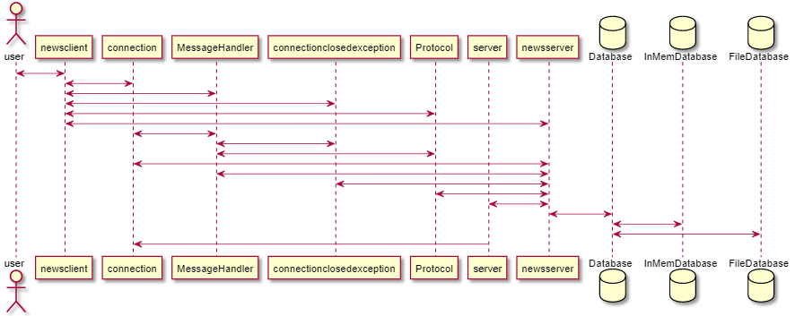

# A Simple News System Implementation :newspaper:
An overview of the system:



## Background
A news system has been developed consisting of a news server and a news client. The server can handle two types databases, one stored in the primary memory (in-memory) and another stored on disk. A database contains newsgroups, where each newsgroup contains articles, and the client accepts commands from the user and communicates with the server. Multiple clients can be connected to the server at any time.

## Installation
Execute the following commands in the /src/ directory:

```
make all
make install
```

## Usage
After the installation, navigate to the /bin/ directory where the executables now will lie with the command:

```
cd ../bin
```
### Run the Server
Run the in-memory version of the server with:
```
./inmemserver [port]
```

Run the disk version of the server with:
```
./diskserver [port]
```
where *port* is the specified port through which the clients and server will communicate (for example '3000').

### Run the Client
The following command will run the client:
```
./newsclient [hostname] [port]
```
where *hostname* specifies the IP-address where the server is hosted, for example 'localhost' if the client runs on the same computer as the server, and *port* is the same as above.


